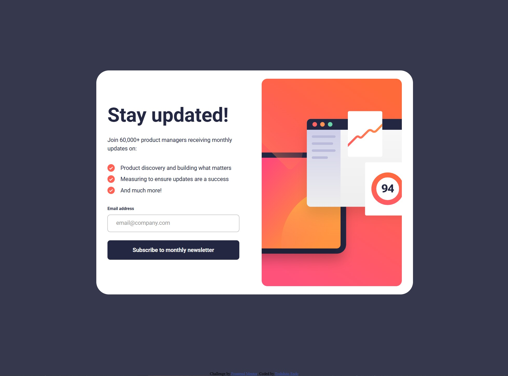

# Frontend Mentor - Newsletter sign-up form with success message solution

This is a solution to the [Newsletter sign-up form with success message challenge on Frontend Mentor](https://www.frontendmentor.io/challenges/newsletter-signup-form-with-success-message-3FC1AZbNrv). Frontend Mentor challenges help you improve your coding skills by building realistic projects.

## Table of contents

- [Overview](#overview)
  - [Screenshot](#screenshot)
  - [Links](#links)
  - [Built with](#built-with)
- [Set up](#set-up)
  - [Install Vite](#install-vite)
  - [Update package json file](#update-package-json-file)
  - [Create vite config file](#create-vite-config-file)
  - [Create script js file](#create-script-js-file)
  - [Modify index html file](#modify-index-html-file)
  - [Reorganise the file structure](#reorganise-the-file-structure)
- [CSS](#css)
  - [Remove default setting](#remove-default-setting)
  - [Define differnt fonts and use with `var()`](#define-differnt-fonts-and-use-with-var)
  - [Unordered list - no style](#unordered-list---no-style)
  - [Padding included width & height](#padding-included-width--height)
  - [List - change colors of dots](#list---change-colors-of-dots)
  - [Set up overall font](#set-up-overall-font)
  - [Table, show borders only inside, only horizontal ones](#table-show-borders-only-inside-only-horizontal-ones)
  - [Table data, list - apply styling to only "n"th child](#table-data-list---apply-styling-to-only-nth-child)
  - [Grid layout - horizontal order](#grid-layout---horizontal-order)
  - [Grid layout - span & align item](#grid-layout---span--align-item)
  - [Postion - absolute position inside an element](#postion---absolute-position-inside-an-element)
  - [Draw vertical line](#draw-vertical-line)
  - [Remove element](#remove-element)
  - [Color + Image](#color--image)
  - [Change color of svg image](#change-color-of-svg-image)
  - [Make an elements non-selectable](#make-an-elements-non-selectable)
  - [Responsive design - "Desktop First"](#responsive-design---desktop-first)
  - [Responsive design - "Mobile First"](#responsive-design---mobile-first)
- [JavaScript](#javascript)
  - [Toggle element(s) by clicking](#toggle-elements-by-clicking)
  - [Retrieving data from the form](#retrieving-data-from-the-form)
- [Resources](#resources)
  - [CSS | Box shadow](#css--box-shadow)
  - [CSS | Grid layout](#css--grid-layout)
  - [CSS | Gradient](#css--gradient)
  - [Client-side from validation](#client-side-from-validation)
  - [Third-party form validation](#third-party-form-validation)
- [Author](#author)

## Overview

### Screenshot



### Links

- Live Site URL: [Live site]()

### Built with

- Semantic HTML5 markup
- CSS custom properties
- Flexbox
- JavaScript
- Vite

## Set up

### Install Vite

```

npm install -D vite

npm install -D vite-plugin-restart

```

### Update package json file

```

{
  "scripts": {
    "dev": "vite",
    "build": "vite build",
    "serve": "vite preview"
  },
  "devDependencies": {
    "vite": "^6.2.1",
    "vite-plugin-restart": "^0.4.2"
  }
}

```

### Create vite config file

**vite.config.js**

```

import restart from "vite-plugin-restart";

export default {
  root: "src/",
  publicDir: "../static/",
  base: "./",
  server: {
    host: true, // Open to local network and display URL
    open: !("SANDBOX_URL" in process.env || "CODESANDBOX_HOST" in process.env), // Open if it's not a CodeSandbox
  },
  build: {
    outDir: "../dist", // Output in the dist/ folder
    emptyOutDir: true, // Empty the folder first
    sourcemap: true, // Add sourcemap
  },
  plugins: [
    restart({ restart: ["../static/**"] }), // Restart server on static file change
  ],
};

```

### Create script js file

```

console.log("hello world");

```

### Modify index html file

```

  <head>

    ....

    <title>Frontend Mentor | Article preview component</title>

    <link href="./style.css" rel="stylesheet" type="text/css" />

    <script defer type="module" src="./script.js"></script>
  </head>

```

### Reorganise the file structure

```

- src
   L index.html
   L script.js
   L style.css

- static
   L images
      L some-image.jpg

- package-lock.json
- package.json
- vite.config.js

```

## CSS

### Remove default setting

```

body {
  margin: 0;
  padding: 0;
  box-sizing: border-box;
}

h1, h2, p {
  margin: 0;
  padding: 0;
}

ul {
  padding: 0;
  list-style-type: none;
}

ol {
  padding: 0;
}

button {
  all: unset;
}

```

### Define differnt fonts and use with `var()`

```

:root {

  /* [font-style] [font-variant] [font-weight] [font-size]/[line-height] [font-family] */


  /* Font | Tag line */
  --font-tag-line: normal normal 200 36px/1.4 "Poppins", sans-serif;
  --font-tag-line-mobile: normal normal 200 24px/1.4 "Poppins", sans-serif;
  --font-tag-line-letter-spacing: 0.25px;
}


.head-line {
  font: var(--font-head-line);
  letter-spacing: var(--font-head-line-letter-spacing);
}

```

### Unordered list - no style

```

ul {
  list-style-type: none;
}

```

### Padding included width & height

```

.card {
  box-sizing: border-box;

  padding: 32px;

  width: 350px;
  height: 250px;
}

```

### List - change colors of dots

```

li::marker {
    color: hsl(332, 51%, 32%);
}

```

### Set up overall font

```

body {

  ....

  font-family: "Outfit", sans-serif;
  font-optical-sizing: auto;
  font-weight: 400;
  font-style: normal;
  font-size: 16px;

  color: hsl(24, 5%, 18%);

  line-height: 150%;
}

```

### Table, show borders only inside, only horizontal ones

```

table {
  border-collapse: collapse;
  border-style: hidden;
}

td {
  border-bottom: 1px solid hsl(30, 18%, 87%);
}


```

### Table data, list - apply styling to only "n"th child

```

td:nth-child(2) {
  font-weight: 700;
  font-style: bold;
  color: hsl(14, 45%, 36%);
  padding: 0 16px 0 8px;
}

td:nth-child(even) {
  font-weight: 700;
  font-style: bold;
  color: hsl(14, 45%, 36%);
  padding: 0 16px 0 8px;
}

td:nth-child(odd) {
  font-weight: 700;
  font-style: bold;
  color: hsl(14, 45%, 36%);
  padding: 0 16px 0 8px;
}

```

### Grid layout - horizontal order

```

-------------
| 1 | 3 | 5 |
-------------
| 2 | 4 | 6 |
-------------

.parent {
  display: grid;
  grid-template-columns: repeat(3, 1fr);
  grid-template-rows: repeat(2, 1fr);
}

.child {
  box-sizing: border-box;
  width: 350px;
  height: 250px;
}

.child:nth-child(1) {
  grid-column: 1;
  grid-row: 1;
}

.child:nth-child(2) {
  grid-column: 1;
  grid-row: 2;
}

.child:nth-child(3) {
  grid-column: 2;
  grid-row: 1;
}

.child:nth-child(4) {
  grid-column: 2;
  grid-row: 2;
}

.child:nth-child(5) {
  grid-column: 3;
  grid-row: 1;
}

.child:nth-child(6) {
  grid-column: 3;
  grid-row: 2;
}

```

### Grid layout - span & align item

```

-------------
|___|2  |___|
|1  |___|4  |
|___|3  |___|
|   |   |   |
-------------

.parent {
  display: grid;
  grid-template-columns: repeat(3, 1fr);
  grid-template-rows: repeat(2, 1fr);
  align-items: center;
}

.child {
  box-sizing: border-box;
  width: 350px;
  height: 250px;
}

.child:nth-child(1) {
  grid-column: 1;
  grid-row: 1 / span 2;
}

.child:nth-child(3) {
  grid-column: 2;
  grid-row: 2;
}

.child:nth-child(4) {
  grid-column: 3;
  grid-row: 1 / span 2;
}

```

### Postion - absolute position inside an element

```

.parent {
  position: relative;
}

.child {
  position: absolute;
}

```

### Draw vertical line

```

.vertical-line {
  width: 2px;
  height: 100px;
  background-color: red;
  margin: 0 auto;
}

```

### Remove element

```

.remove-element {
  display: none;
}

```

### Color + Image

```

.parent {
  position: relative;
  background-color: #006064;
  overflow: hidden;
}

.child {
  position: absolute;
  object-fit: cover;
  opacity: 0.1;  // control opacity here
  top: 0;
  left: 0;
  width: 100%;
  height: 100%;
}

```

### Change color of svg image

**html**

```

<div class="svg-image-container"></div>

```

**css**

```

.svg-image-container {

  width: 32px; /* Adjust container width */
  height: 32px; /* Adjust container height */

  background-color: var(--grey-500); /* Set color */

  /* Apply the SVG as a mask */
  -webkit-mask-image: url("/images/icon.svg");
  mask-image: url("/images/icon.svg");

  /* Control size of the SVG */
  -webkit-mask-size: 50%; /* Scale the SVG within the container */
  mask-size: 50%;

  -webkit-mask-repeat: no-repeat;
  mask-repeat: no-repeat;

  -webkit-mask-position: 50% 40%; /* <x-position> <y-position> */
  mask-position: 50% 40%;
}

```

### Make an elements non-selectable

```

.non-selectable-element {
    -ms-user-select: none;
    -webkit-user-select: none;
    user-select: none;
}

```

### Responsive design - "Desktop First"

```

/* Default: Large devices such as laptops, computers (greater than 1024px) *

/* RESPONSIVE DESIGN | Medium devices such as tablets (1024px or lesser) */
@media only screen and (max-width: 1024px) { .... }

/* RESPONSIVE DESIGN | Small devices such as phones (768px or lesser) */
@media only screen and (max-width: 768px) { .... }

```

### Responsive design - "Mobile First"

```

/* This is how your website looks on mobile by default */
main {
  display: flex;
  flex-direction: column;
}

/* This changes the layout for screens wider than 48em */
@media (min-width: 48em) {
  main {
    flex-direction: row;
  }
}

```

## JavaScript

### Toggle element(s) by clicking

**css**

```

.toggle-element.active {
  display: none;
}

.toggle-element.active {
  display: block;
}

```

**js**

```

const toggleButton = document.getElementById("toggleButton");
const toggleTriggeredElement = document.getElementById("toggleTriggeredElement");

toggleButton.addEventListener("click", () => {
  toggleTriggeredElement.classList.toggle("active");
});

```

### Retrieving data from the form

```

const form = document.getElementById("form");

const handleSubmit = (e) => {
  e.preventDefault(e);

  const formData = new FormData(e.target);
  const data = Object.fromEntries(formData);

  console.log(data);
};

form.addEventListener("submit", handleSubmit);

```

## Resources

### CSS | Box shadow

- [Beautiful CSS box-shadow examples](https://getcssscan.com/css-box-shadow-examples)

### CSS | Grid layout

- [MDN Docs | CSS grid layout](https://developer.mozilla.org/en-US/docs/Web/CSS/CSS_grid_layout)
- [grid-auto-flow : CSS Grid :: flex-direction : Flexbox](https://css-tricks.com/grid-auto-flow-css-grid-flex-direction-flexbox/)
- [From Zero to Grid Hero: An Illustrated Guide](https://blog.bitsrc.io/from-zero-to-grid-hero-illustrated-guide-to-css-grid-essentials-cd1531b56431)

### CSS | Gradient

- [CSS Gradient](https://cssgradient.io/)
- [Using CSS gradients](https://developer.mozilla.org/en-US/docs/Web/CSS/CSS_images/Using_CSS_gradients)

### Client-side from validation

- [How to Build and Validate Beautiful Forms](https://www.freecodecamp.org/news/build-and-validate-beautiful-forms-with-vanilla-html-css-js/)
- [Built-in form validation examples](https://developer.mozilla.org/en-US/docs/Learn_web_development/Extensions/Forms/Form_validation)

### Third-party form validation

- [Validator.js](https://github.com/jaywcjlove/validator.js)
- [Just-Validate](https://github.com/horprogs/Just-validate)
- [Bouncer](https://github.com/cferdinandi/bouncer)

## Author

- Website - [Toshihito Endo](https://toshihito-endo.com/works)
- Frontend Mentor - [@GentleHorse](https://www.frontendmentor.io/profile/GentleHorse)
- X - [@toshihito_endo](https://x.com/toshihito_endo)
